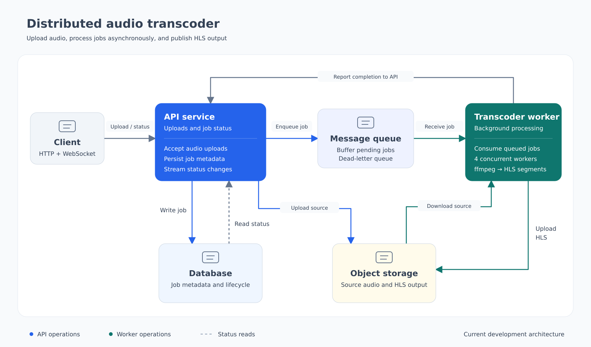

# Distributed Audio Transcoder Design

Status: current implemented design

## 1. Overview

The project implements an asynchronous audio processing pipeline. A client uploads an audio file to the API service. The API stores the source in object storage, sends a job message to the message queue, and records job metadata in the database. A transcoder worker consumes the message, creates an HLS playlist and segments, uploads the generated files, and reports completion to the API service.

Clients can retrieve job metadata or receive status changes through the status interface.

## 2. Architecture



The API service handles client requests and job metadata. The message queue separates upload requests from background processing. The transcoder worker performs the media conversion. The database stores job records, and object storage holds the source and generated files.

### Components

| Component | Implemented responsibility |
| --- | --- |
| Client | Upload an audio file and request job status |
| API service | Generate job identifiers, upload source files, publish work messages, store job metadata, expose status, and accept completion updates |
| Database | Store job identifiers, status, source metadata, output path, and timestamps |
| Message queue | Transport work messages from the API service to the transcoder worker |
| Object storage | Store source audio and generated HLS files |
| Transcoder worker | Consume messages, download source audio, run the media conversion pipeline, upload HLS files, and notify the API service |

## 3. Current processing flow

1. The client submits an audio file to the API service.
2. The API service generates a job identifier.
3. The source file is uploaded to object storage and a signed source reference is created.
4. The API service publishes a message containing the job identifier and source reference.
5. The API service creates a database record with status `queued`.
6. The transcoder worker receives messages and places their source references on an internal work channel.
7. Four worker routines process the channel. Each worker downloads the source, runs the media conversion command, and creates HLS output with fixed processing settings.
8. The generated playlist and segments are uploaded to object storage.
9. The worker sends the generated output path to the API service.
10. The API service updates the job record to `completed`.

## 4. Job record and status

The database record contains the job identifier, queue name, status, attempt count, source path, source MIME type, source size, output path, output format, and lifecycle timestamps.

The active flow currently uses this transition:

```text
queued → completed
```

The data model also defines `processing`, `failed`, and `cancelled` states, but the current API and worker flow does not write those states. The missing lifecycle behavior is tracked in [TODO.md](TODO.md).

## 5. Client and worker interfaces

The project exposes these logical operations:

| Interface | Purpose |
| --- | --- |
| Upload | Receive an audio file and return its job metadata |
| Job lookup | Return the current database record for a job |
| Status stream | Send changed job status until the job is complete |
| Work message | Carry a job identifier and source reference from the API service to the worker |
| Completion update | Carry the generated output path from the worker to the API service |

The current work message has this shape:

```json
{
  "input_path": "<signed source reference>",
  "job_id": "<job identifier>"
}
```

## 6. Current processing characteristics

- Source and generated media are stored in object storage.
- The worker uses four concurrent processing routines.
- The media pipeline creates an HLS playlist with fixed segment settings.
- Status streaming checks the database periodically and stops after the job is complete.
- The output path reported to the API is currently the worker's generated path.

## 7. Scope and follow-up work

This document describes behavior that exists in the current project. Missing production and product capabilities are collected separately in [TODO.md](TODO.md), including reliable retries, failure tracking, configurable processing, validation, durable configuration, access control, and observability.
